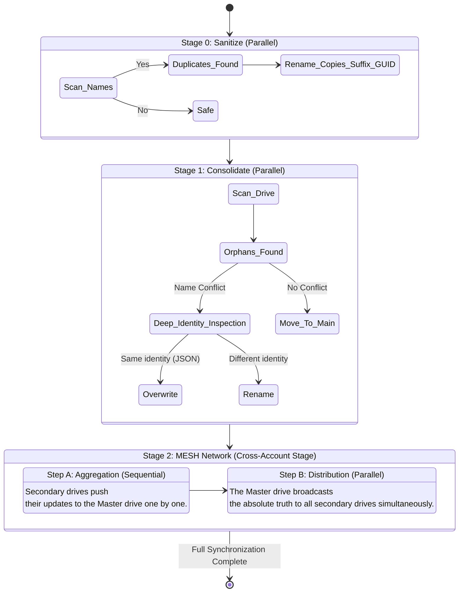

# Google AI Studio Sync (FolderSync)

<!---->
<!--*FolderSync in action: Seamlessly syncing conversations across multiple Google Drive accounts with live task tracking.*-->

**FolderSync** is a highly specialized, desktop application built with **.NET 8** and **Avalonia UI**, designed specifically for **Google AI Studio** users who operate across multiple Google accounts.

## The Problem It Solves

If you use multiple Google accounts (e.g., personal, work, or to manage API rate limits), you've likely noticed that your Google AI Studio conversations are isolated. They are stored as specific `.prompt` files on your Google Drive. Switching accounts means losing your chat history and context.

**FolderSync** solves this by orchestrating a secure, automated synchronization pipeline. You can start a conversation with Gemini on Account A, hit "Sync", and seamlessly continue that exact same conversation from Account B.

## Key Features

- **Server-Side Synchronization:** Uses **Rclone** as its backend engine to perform server-side copies across your accounts, saving your local bandwidth.
- **Automated MESH Networking:** You don't have to share folders manually. The app uses the Google Drive REST API to automatically cross-share your "Google AI Studio" folders among all connected accounts.
- **Intelligent Conflict Resolution:** Automatically detects and resolves name collisions and recovers orphaned folders using deep JSON-level identity inspection.
- **Profile Backups:** Export and move your multi-account setup using AES-GCM 256-bit encrypted `.fsbak` files.
- **Multilingual UI:** Clean, responsive interface available in English and Polish.
- **Zero-Configuration:** Built-in Rclone bootstrapper with SHA256 supply-chain verification. No external installations required.

## System Requirements

- **Standalone Executable:** No .NET runtime installation is required! The application is compiled as a self-contained binary. Just download and run.
- **Operating Systems:** Windows 10/11 (x64), Linux (x64/arm64), and macOS (x64).
- **Internet:** Active connection required for Google Drive API communication and the initial one-time Rclone engine download.

## How It Works (The Engine Architecture)

The synchronization engine (`SyncEngine.cs`) uses a highly optimized, hybrid approach (Scatter-Gather pattern) to ensure data integrity and avoid cloud race conditions:

## Security & Privacy

This tool respects your data and employs enterprise-grade security patterns:
* **Local Only:** There are no telemetry, tracking, or middle-man servers. Communication happens directly between your machine and Google APIs.
* **At-Rest Encryption:** OAuth tokens are never stored in plaintext on your disk. They are encrypted using AES-GCM with an OS-native, machine-bound key (DPAPI on Windows, machine-bound HKDF on Linux / Keychain on macOS). 
  > *Security Note:* This "Soft Protection" prevents token theft via simple file copying or basic info-stealers. However, it cannot protect against an attacker who has gained full root/administrator access to your currently running system.
* **Secure Backups:** Exported profiles (`.fsbak`) are securely encrypted using AES-GCM and PBKDF2 (600k iterations) with your custom password, allowing safe transfer between machines.
* **Atomic Operations:** Configuration changes use atomic file operations (`.tmp` file swapping) to prevent corruption during unexpected shutdowns or power losses.

## Technology Stack

| Component | Technology |
|---|---|
| **Runtime** | .NET 8 (Self-Contained) |
| **UI Framework** | Avalonia UI |
| **Architecture** | Clean Architecture / MVVM (CommunityToolkit) |
| **Cloud Backend** | Rclone (Managed via isolated hidden OS processes) |
| **HTTP Resilience** | `Microsoft.Extensions.Http.Resilience` |

## Getting Started (Download & Run)

The application is fully portable (Self-Contained) and **does not require** the .NET runtime to be installed on your system.

1. Go to the **[Latest Release](../../releases/latest)** page.
2. Download the `.zip` archive corresponding to your operating system (Windows, macOS, or Linux) and extract it.
3. Run the `FolderSync` executable. 
   > **Security Note:** On its first launch, the app will automatically download the required Rclone engine (v1.73.1) directly from its official GitHub repository. The binary is instantly verified against hardcoded SHA256 checksums to ensure strict supply-chain security.
4. Go to the **Drive Management** tab and add your Google accounts.
5. Select one account as the **Master** drive.
6. Hit **START SYNC** in the Synchronization tab and watch the magic happen.

---
**Troubleshooting Unsigned Binaries:**
Because this is a free, open-source tool without a paid cryptographic certificate, your operating system might display a warning on the first run:
* **Windows (SmartScreen):** Click *"More info"* -> *"Run anyway"*.
* **macOS (Gatekeeper):** Right-click the app icon and select *"Open"* from the context menu, or allow it in *System Settings -> Privacy & Security*.
* **Linux:** Depending on your DE, you might need to allow executing the file as a program (`chmod +x FolderSync`).

## License
Open Source (MIT License).
